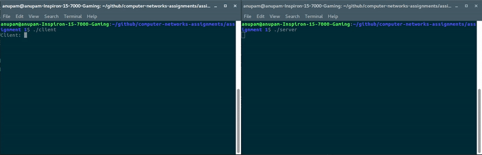

# Assignment 1

## Instructions to run client server chat program

1. Compile tcpclient and tcpserver using gcc.  
`gcc tcpclient.c -o client`  
`gcc tcpserver.c -o server`
2. Open two terminals, run server in one and client in the other. Make sure to run server before client.  
`./server`  
`./client`
3. Now the communication between client can server can proceed. Send a message from client, it will be received on server and same happens from server to client.
4. To end the chat, send `bye` as a message.

## Instruction to run linkedlist

1. Compile and run `linkedlist.c` as a normal c program.
2. Various available operations will be provided on screen.