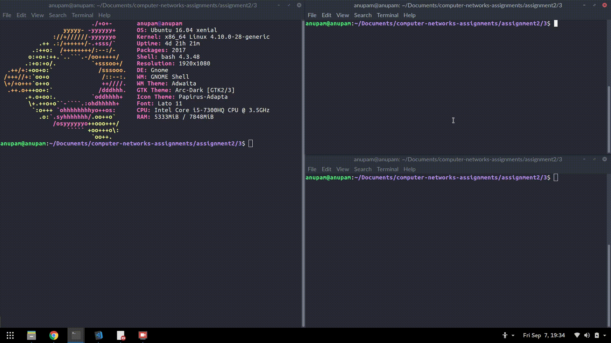

# Ques 3

## Problem Statement
You need to build a very simple client-server operation using the Stream capabilities.
You are to build a client and server pair, to implement your own little directory
service. Suppose that the server has the following database:

0 Bob  
3 Anne  
5 Barb  
7 Ray  
9 Denbigh  
10 Terri  
104 John

This can be in a file that is read. The client is to read a request, which is a numeric
address to be sent to the server. The servers look up the matching name and send it
back to the client to be printed out. If the address isn't found, the server should send
back an error message. For example, "Address not found".

## Instructions to run
1. Compile the files `server.c` and `client.c`. For this run the `compile.sh` script as follows  
`./compile.sh`  
If the above gives some error then use  
`sudo bash compile.sh`  
to run the script.
Alternatively you can compile using the following commands:  
`gcc server.c -o server`  
`gcc client.c -o client`  
2. Open 2 terminals, run server and client in the same order. Make sure to run server first.  
`./server` (terminal 1)   
`./client` (terminal 2)  
3. Follow the on screen instructions.

